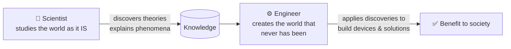
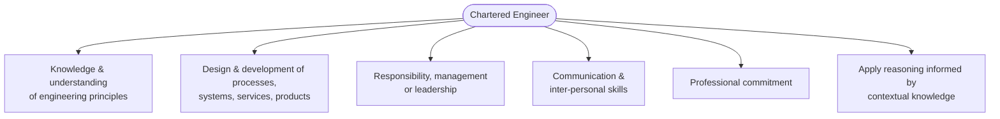

# 01 · Engineer & Society — Foundations

> Source: *Lesson 1 — Engineer and Society* (Eng. P. W. Sarath) + *SLASSCOM Employability Skills Survey 2024*
> Related: [Professional Ethics](<../02 · Professional Ethics/README.md>), [Industrial Relations & Labour Law](<../06 · Industrial Relations & Labour Law/README.md>)

---

## 1. What is Engineering?

> [!NOTE]
> **Engineering** is the profession in which knowledge of the **mathematical and natural sciences** — gained by study, experience and practice — is applied **with judgment** to develop ways to **utilise economically** the materials and forces of nature **for the benefit of mankind**.

The four load-bearing words in that definition: **judgment**, **economically**, **forces of nature**, and **benefit of mankind**.

---

## 2. Engineer vs Scientist

| | Scientist | Engineer |
|---|---|---|
| Goal | **Discovers** theories to explain existing phenomena | **Innovates** devices/solutions using those discoveries |
| Focus | The world *as it is* | The world *that never has been* |
| Output | Knowledge & understanding | Applications that solve problems of living beings |

> [!TIP]
> Two quotable lines from the lecture:
> - *"Scientists study the world as it is; engineers create the world that never has been."* — **Theodore von Kármán**
> - *"Engineering is the application of science to the common purpose of life."* — **Count Rumford**

---

## 3. Society ↔ Engineer: what society demands

Society = people living together in community. They demand goods and services from engineers with these **deliverable values**:

- **Reliability**
- **Safety and Security**
- **Standards**
- **Economy** (incl. the digital economy)

---

## 4. Competencies of a Chartered Engineer

The six competency areas required to become a **Chartered Engineer**:

> [!IMPORTANT]
> The **role of an engineer** (definition to know): *apply reasoning informed by contextual knowledge to assess **societal, health, safety, legal and cultural** issues — and the consequent responsibilities — relevant to professional engineering practice and solutions to complex engineering problems.*

---

## 5. Roles, Responsibilities & Functions

### 5.1 Core responsibilities

> [!IMPORTANT]
> The engineering profession must place **priority on public safety and interest over all others.** ==This is the #1 recurring exam principle.==

- Be **accountable** for the wellbeing of others in society and the impact of their work.
- Make determined efforts to **discuss all relevant facts** (honesty/transparency).

### 5.2 Social responsibilities of engineers (selected)

- Ensure the **safety and wellbeing of the public**.
- Ensure society's **funds and resources** for technology are well used.
- **Refuse** to work on a project/company when ethics demand it; **speak out** publicly against a harmful project.
- **Blow the whistle** on illegality or wrongdoing; societies must **protect whistleblowers**.
- Commit to **sustainable technologies** and the **precautionary principle**.
- Apply **factors of safety** and build in **redundancy** in design.
- **Educate the public and future engineers** about consequences and social responsibility.

> [!TIP]
> Notice how 5.1–5.2 directly seed quiz answers: *whistleblowing, public safety first, environmental sustainability, lifelong learning/educating others.*

### 5.3 Roles an engineer plays

Team leader · Manager · Representative · Motivator · Planner · Decision-maker · obliging to rules & regulations.

### 5.4 Job functions of an engineer

Network planning & design · Project implementation · Operation & maintenance · Research & development.

### 5.5 Key activities & responsibilities (management view)

- **Planning & budgeting** key activities from corporate goals.
- **Communicate & allocate resources** to staff; assign targets derived from corporate goals.
- Ensure processes are well established; apply changes where necessary.
- **Key responsibilities:** review progress (expected vs actual), organise **competency-development** programmes, look after staff wellbeing, **performance appraisal**, **counselling & coaching**.

---

## 6. Rules of Conduct (By-laws) — the value set

> [!NOTE]
> *Any engineer shall at all times uphold the **dignity and reputation** of the profession; act with **fairness and integrity** towards everyone connected to their work and towards other members; and **safeguard the public interest** in matters of health, safety, the environment and otherwise.*

Embedded values: **Integrity · Fairness · Health · Safety & Risk · Environmental sustainability · Competence.**

Engineers must also exercise professional skill and judgment to the best of their ability, discharge responsibilities **with integrity**, and **encourage the vocational progress** of those in their charge.

---

## 7. Legislative requirements (Sri Lanka) 🇱🇰

> [!IMPORTANT]
> Know these named laws — they recur across Foundations, Safety and Industrial Relations:
> - **Engineering Council Act No. 04 of 2017** (ECSL)
> - **IESL Act** (Institution of Engineers, Sri Lanka)
> - **Safety and Factory Ordinance** (Factories Ordinance)
> - **Industrial Disputes Act**
> - **Environmental Regulations**

---

## 8. Benefits of being an engineer

Job satisfaction · variety of career opportunities · challenging work · intellectual development · benefit to society · financial security · prestige · professional environment · technological & scientific discovery · creative thinking.

---

## 9. Employability skills (SLASSCOM 2024 context) 💼

> [!NOTE]
> SLASSCOM is the **national chamber for the IT/BPM industry** in Sri Lanka (members ≈ 90% of IT/BPM export revenue). Its survey links university competencies to what industry actually hires for.

Key takeaways connecting to the "competencies" theme:

- Industry wants **both** technical skills **and** soft skills — communication, problem-solving, teamwork, adaptability, leadership.
- **AI** is rapidly reshaping which skills are in demand → reinforces **lifelong learning** (a quiz answer!).
- ~**89%** of employers hire graduates *and* undergraduates as **interns**.
- **Workplace diversity** drives better innovation and outcomes → reinforces **diversity & inclusivity** (a quiz answer!).
- Emphasis on **human-machine teaming** — collaboration between humans and AI.

> [!TIP]
> The SLASSCOM report itself is unlikely to be quizzed in detail, but two of its themes — **continuous learning** and **diversity/inclusivity** — *are* in the question bank. See [Quiz Concept Bank](<../Quiz Concept Bank — CA 2 Prep/README.md>).
