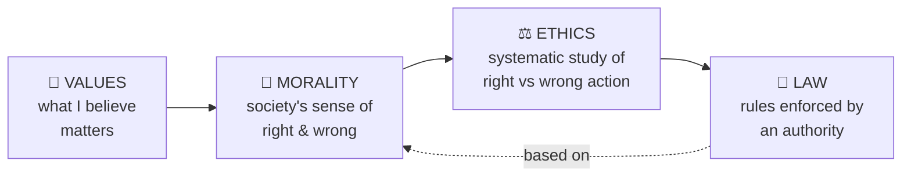
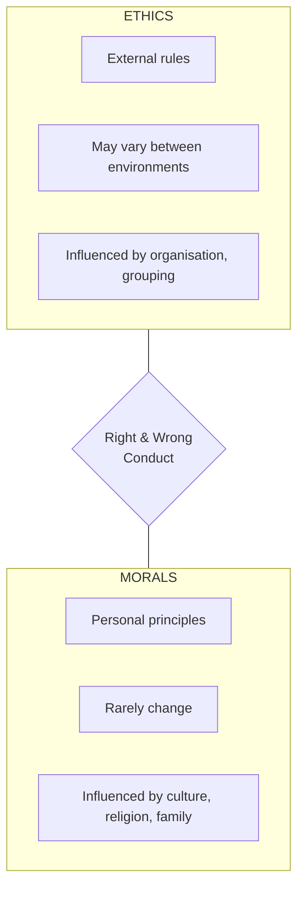
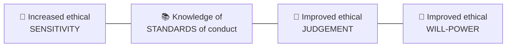

# 02 · Professional Ethics ⚖️

> Source: *Lesson 2 — Professional Ethics for Engineers* + *Week 5 Code-of-Ethics case study* (Eng. P. W. Sarath)
> Related: [Conflict of Interest](<../04 · Conflict of Interest/README.md>), [Case Studies Compendium](<../08 · Case Studies Compendium/README.md>)
> Quiz weight: 🎯🎯🎯🎯🎯 — **the single biggest topic.**

---

## 1. The four key words: VALUES → MORALITY → ETHICS → LAW

| Term | Meaning | Key idea |
|---|---|---|
| **Values** | Beliefs of an individual/group they have an emotional investment in; stable, long-lasting standards by which people order their lives. | *"What you do when no one is looking."* **Intrinsic** = truthful, honest, loyal, courage (the destination). **Extrinsic** = wealth, fitness, teamwork (the means). |
| **Morality** | Values that govern a **society's** attitude towards right/wrong. (Latin *moralitas* = manner, character.) | "Society says stealing is **wrong**." Concerns social practice. |
| **Ethics** | Attempt to **determine what those values should be**; systematic study of human action as right/wrong. (Greek *ethos* = character.) | "Ethical theory examines and **explains why** stealing is wrong." Promotes human welfare / "the good." |
| **Law** | Rules & regulations **enforced by an authority** to regulate subjects' conduct. | Generally **based on the moral principles** of society. |

> [!IMPORTANT]
> One-liner to memorise: **Morality says *what* is right; Ethics explains *why*; Law *enforces* it; Values are *personal* beliefs underneath all three.**

---

## 2. Ethics vs Morals (a favourite distinction)

> [!NOTE]
> - **Morals** = personal, shaped by environment & belief system; the *basis* for ethics; rarely change.
> - **Ethics** = more **practical**; a *set of rules* a group follows (e.g. a professional code). An ethical code need not be "moral."

> [!WARNING]
> **Ethics aren't always moral — and vice-versa.** Two lecture examples:
> - **Omertà** (Mafia code of silence): follows the *organisation's* ethics, but is **morally wrong**.
> - A lawyer telling the court his client is guilty: a **moral** act (wanting justice), but **unethical** (violates attorney–client privilege).

---

## 3. Eastern vs Western Ethics 🥷🤠

> *"Ninja/Samurai vs Cowboy."*

| | Eastern | Western |
|---|---|---|
| **Focus** | Protocol & respect | Finding truth |
| **Basis** | Religious teachings | Rational thought |
| **Emphasis** | Respect toward family | Logic, cause & effect |
| **Roots** | Hinduism, Buddhism, etc. | Roman, Christian, etc. |
| **Approach** | Holistic & cultural | Rational |
| **Conflict & harmony** | Good & bad, light & dark exist in **equilibrium** | **Good must triumph** over evil |

---

## 4. Professional Ethics vs Personal Ethics

> [!IMPORTANT]
> ==**Professional ethics** = guidelines established by **professional organisations** that govern behaviour in a *business/professional* environment.== (This exact phrasing is a quiz answer — the trap option is "personal values and morals of individuals.")

- **Personal ethics** — ethics a person identifies with in everyday life.
- **Professional ethics** — ethics a person must adhere to in their professional dealings.

> [!WARNING]
> Personal and professional ethics can **clash** → a **moral conflict**:
> - A police officer may *personally* think a law is wrong, but the Code of Conduct requires him to enforce all lawful instructions.
> - A doctor may *personally* disagree with a patient's choice, but the Code of Ethics requires respecting patient autonomy.

---

## 5. Why study professional ethics? (4 outcomes)

The four pillars: **SENSITIVE · STANDARDS · JUDGEMENT · WILL-POWER.**

> [!NOTE]
> Why it matters: *people rely heavily on engineers for safe, reliable goods and services. Mistakes by unethical/incompetent engineers don't just cost money — **they can cost lives.***

---

## 6. Ethical Dilemmas

> [!NOTE]
> An **ethical dilemma** arises when an engineer must choose between conflicting duties, with no clean "right" answer.

Lecture examples:
- **Consulting firm in a slow economy** → a project manager demands a **kick-back**. Dilemma: *bankruptcy & lost jobs* vs *paying the bribe.*
- **"To ship or not to ship"** → new product, deadline looming, **QA not complete.**

> [!IMPORTANT]
> Exam rule for *any* ethical-dilemma question: an engineer should prioritise ==**the welfare of society and the environment**== above employer interest, personal gain, or blind rule-compliance. The decision is shaped by the engineer's **knowledge of ethics, analytical power, judgement and experience.**

---

## 7. Codes of Ethics 📜

### 7.1 IESL Code of Ethics — 8 basic principles

> [!IMPORTANT]
> Institution of Engineers, Sri Lanka (IESL). ==Principle 1 is always paramount.==

| # | Basic principle (short) | Meaning |
|:-:|---|---|
| 1 | **Public goodness is paramount** | Health, safety, welfare of public + proper use of funds & resources comes **first**. |
| 2 | **Uphold professional dignity** | Uphold & enhance the honour, integrity and dignity of the profession. |
| 3 | **Practice sustainable engineering** | Sustainable management of resources; minimise adverse environmental impacts for present & future generations. |
| 4 | **Build reputation on merit** | Don't compete unfairly. |
| 5 | **Limit to area of competence** | Perform services only where competent. |
| 6 | **Serve benefactors faithfully** | Act as faithful agent/trustee for employer/client — **with no conflict** to the other principles or the public interest. |
| 7 | **Speak out objectively & truthfully** | Give evidence/opinions in an objective, truthful manner. |
| 8 | **Continuously develop knowledge & skills** | Lifelong development; help engineers under your direction advance. |

### 7.2 NSPE Code of Ethics — 6 Fundamental Canons

> [!NOTE]
> National Society of Professional Engineers (USA) — represents licensed PEs. Engineers shall:

1. **Hold paramount the safety, health & welfare of the public**
2. Perform services only in areas of **competence**
3. Issue public statements only in an **objective and truthful** manner
4. Act for each employer/client as **faithful agents or trustees**
5. **Avoid deceptive acts**
6. Conduct themselves **honourably, responsibly, ethically and lawfully** to enhance the honour, reputation and usefulness of the profession

### 7.3 IESL ↔ NSPE side-by-side

| IESL basic principle | NSPE fundamental canon |
|---|---|
| 1 Public goodness is paramount | 1 Hold paramount safety, health & welfare of the public |
| 2 Uphold professional dignity | 6 Conduct honourably to enhance the profession |
| 3 Practice sustainable engineering | *(implicit in public welfare)* |
| 4 Build reputation on merit | 5 Avoid deceptive acts |
| 5 Limit to area of competence | 2 Perform only in areas of competence |
| 6 Serve benefactors faithfully with no conflict | 4 Act as faithful agents/trustees |
| 7 Speak out objectively & truthfully | 3 Public statements objective & truthful |
| 8 Continuously develop knowledge | *(professional obligation)* |

> [!TIP]
> If a question asks for the **purpose of a professional code of ethics**, the answer is ==**"to ensure the welfare of clients and the public"**== — *not* legal protection, not limiting competition, not disciplinary enforcement.

---

## 8. Worked case — Confidentiality vs Public Duty (NSPE) 🔥

> [!NOTE]
> **Scenario:** A building fire kills/injures several people. Lawyer-X hires **Engineer-A** for a forensic investigation. Her report reveals **safety-standard issues in the building materials.** Lawyer-X & Client-Y then reach a **court-approved private settlement** that orders Engineer-A **not to reveal** the report's contents.

**The dilemma:** **Confidentiality** (to the client) vs **obligation to the public.**

**Analysis:**
- The confidentiality comes from a **court-approved settlement**, not just a private NDA.
- The facts **don't** suggest **urgent or imminent harm** to public health/safety.

> [!IMPORTANT]
> **Conclusion:** Engineer-A has an ethical obligation to **maintain confidentiality** of the report — but may pursue a **middle ground**: e.g. publish *general* research explaining the technical concern **without** revealing the specific, identifiable facts of the settled case. This fulfils duties **both** to the public *and* the client.

> [!TIP]
> Lesson: codes of ethics **conflict** in practice. The public-safety-vs-confidentiality clash is the classic one. The "right" answer balances both — and **escalates to authorities only when there is danger to life or property** (IESL 1.5 / NSPE II.1.a).

---

## 9. Ethics quick-fire (exam reflexes)

> [!IMPORTANT]
> | If the question is about… | The correct answer is… |
> |---|---|
> | Primary responsibility of engineers | Prioritising **public safety, health & welfare** |
> | Accuracy & honesty of work | Ensure all information is **truthful and transparent** |
> | An ethical dilemma | Prioritise **welfare of society & the environment** |
> | Whistleblowers | **Report unethical behaviour to external authorities** |
> | Lifelong learning | **Continuously update skills & knowledge** |
> | Diversity & inclusivity | **Advocate equal opportunities & representation for all** |
> | Ethical use of tech / AI | Design with **built-in safeguards & ethical considerations**; respect human rights |
> | Environmental sustainability | Design solutions that **minimise negative environmental impacts** |
> | NOT a common ethical principle | **Profit maximisation** (objectivity, integrity, confidentiality *are* principles) |
