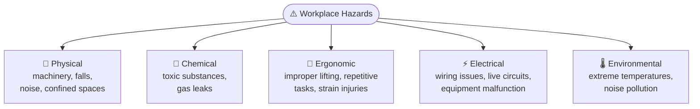
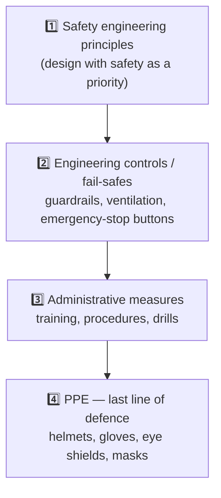

# 03 · Workplace Safety 🦺

> Source: *Lesson 3 — Safety in the Workplace* (Eng. P. W. Sarath)
> Related: [Industrial Relations & Labour Law](<../06 · Industrial Relations & Labour Law/README.md>) (Factories Ordinance, OHS), [Case Studies Compendium](<../08 · Case Studies Compendium/README.md>) (Meethotamulla)
> Quiz weight: 🎯🎯🎯🎯🎯 — **~10+ questions come from here.**

---

## 1. Why safety matters

> [!IMPORTANT]
> The **primary objective of industrial safety** is ==**preventing accidents and injuries in the workplace**== — *not* maximising output, cutting costs, or reducing turnover.

Workplace safety **prevents injuries, fatalities and losses**, ensures **compliance with legal standards**, and has a **direct impact on productivity and project quality** (reduces risk in high-stakes environments).

**Definition:** measures and procedures to **protect health and wellbeing at work.**

---

## 2. Workplace hazards in engineering (5 types)

> [!WARNING]
> Classic trap question: *"Which is NOT a common hazard?"* → **Excessive productivity**. (Chemical exposure, ergonomic strain, and noise pollution **are** real hazards.)

---

## 3. Laws & regulations (Sri Lanka) 🇱🇰

> [!IMPORTANT]
> | Law / body | Role |
> |---|---|
> | **Occupational Safety Standards** | Baseline safety standards |
> | **Factories Ordinance** | Ensures safety in **industrial workplaces** |
> | **NIOSH** (National Institute of Occupational Safety and Health) | Safety & health oversight |

**Duties split:**
- **Employer** → ensure a **safe work environment.**
- **Employee** → **adhere** to safety guidelines and **report hazards.**

> [!NOTE]
> The **purpose of occupational health & safety (OHS) regulations** in labour law is to **minimise workplace accidents and injuries** — see [Industrial Relations & Labour Law](<../06 · Industrial Relations & Labour Law/README.md>).

---

## 4. The hierarchy: engineering controls → PPE

### 4.1 Engineering controls & safety systems

- **Design with safety as a priority** (safety engineering principles).
- Implement **fail-safes** and **risk-reduction mechanisms.**
- Examples: **guardrails, ventilation systems, emergency-stop buttons.**

### 4.2 Personal Protective Equipment (PPE)

> [!IMPORTANT]
> ==**PPE is used to minimise the risk of injury or illness from workplace hazards.**== It does **NOT** replace engineering/administrative controls — it's the *last* line of defence.

- Common PPE: **helmets, gloves, eye shields, masks.**
- Usage tips: **select PPE specific to the task; inspect PPE regularly.**

---

## 5. Proactive vs reactive safety

> [!TIP]
> The quiz repeatedly rewards **proactive** (before-the-event) measures and punishes **reactive** ones.

| Proactive ✅ | Reactive / wrong ❌ |
|---|---|
| Regular **safety inspections & audits** | Only treating injuries *after* an accident |
| **Safety training** for all employees | Training "only certain roles" |
| **Regular equipment maintenance** (prevents failure & accidents) | Ignoring maintenance to cut costs |
| **Hazard communication** programs (train staff to avoid hazards) | Concealing hazard info from employees |
| **Safety drills** (familiarise staff with emergency procedures) | Punishing staff for raising concerns |

---

## 6. Building a positive safety culture

> [!IMPORTANT]
> Safety is ==**everyone's responsibility.**== Management promotes a safety culture **by leading by example and actively encouraging safe practices** — *not* by incentivising shortcuts or punishing those who report concerns.

- **Responsibility:** report unsafe conditions **promptly.**
- **Encourage open discussion** about safety.

> [!WARNING]
> *"Which is NOT a responsibility of engineers concerning workplace safety?"* → **Prioritising project deadlines over employee safety.** Deadlines **never** outrank safety.

---

## 7. Incident response & emergency procedures 🚑

- **Basic first aid:** know **CPR**, treat minor wounds, respond to **burns.**
- **Emergency protocols:** evacuate if necessary, follow **fire response** guidelines, handle **chemical spills.**
- **Drills:** regular fire & emergency drills to ensure **preparedness.**

> [!IMPORTANT]
> **Why have emergency response plans?** The official quiz answer is ==**to comply with regulatory requirements.**==
>
> ⚠️ **Trap alert:** the tempting distractor "to reduce the likelihood of accidents" is marked **wrong** in the answer key — a plan responds to incidents, it doesn't reduce their *likelihood*. (Both students who picked "reduce likelihood" lost this mark.) **Pick "comply with regulatory requirements."**

---

## 8. Real incidents & lessons (engineering)

- Typical incidents: **falls from heights, equipment accidents, chemical burns.**
- Lessons learned: importance of **PPE, alertness, adherence to safety guidelines.**
- See the **Meethotamulla garbage-dump collapse** (32 deaths, 2017) in [Case Studies Compendium](<../08 · Case Studies Compendium/README.md>) — a textbook failure of safety & risk management.

### Practical tips for internships
- **Preparation** — familiarise yourself with workspace & safety procedures.
- **Proactiveness** — clarify safety protocols with supervisors.
- **Communication** — report unsafe conditions or practices.

---

## 9. Safety quick-fire (exam reflexes)

> [!TIP]
> | Question theme | Correct answer |
> |---|---|
> | Primary objective of industrial safety | **Prevent accidents & injuries** |
> | Role of safety training | Ensure employees **know procedures & protocols** |
> | Proactive safety measure | **Regular inspections & audits** |
> | Purpose of PPE | **Minimise risk of injury/illness** from hazards |
> | Equipment maintenance | **Minimise risk of equipment failure & accidents** |
> | Hazard communication programs | **Train employees to avoid hazards** |
> | Safety drills | Ensure staff are **familiar with emergency procedures** |
> | Promote safety culture | **Lead by example & encourage safe practices** |
> | Emergency response plans | **Comply with regulatory requirements** |
> | NOT a hazard | **Excessive productivity** |
> | NOT a safety responsibility | **Prioritising deadlines over safety** |
