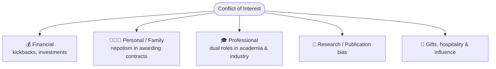
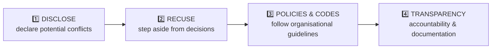

# 04 · Conflict of Interest (COI) 🤝💰

> Source: *Week 6 — Conflict of Interest in Engineering* (Eng. Sarath Wickramasuriya) + *Week 5 appointment case study*
> Related: [Professional Ethics](<../02 · Professional Ethics/README.md>), [Public Procurement & Tendering](<../05 · Public Procurement & Tendering/README.md>), [Case Studies Compendium](<../08 · Case Studies Compendium/README.md>)
> Quiz weight: 🎯🎯🎯🎯🎯 — **the most heavily-repeated single theme (~10–12 questions).**

---

## 1. Definition

> [!IMPORTANT]
> A **conflict of interest** arises when **personal interests compromise professional judgment.**
> In engineering terms: ==when engineers **prioritise personal gain over professional responsibilities.**==

Why it matters in engineering: **safety, ethics, and trust.** Governed by professional codes — **IEEE, IESL, NSPE.**

> [!TIP]
> A COI does **not** require *proof* of actual bias. It exists whenever judgment **could reasonably appear** compromised. **Perception = Reality.** (This is the core insight from both the lecture and the assignment case.)

---

## 2. Types of conflict of interest

---

## 3. Worked case examples (from the lecture)

| Case | Why it's a COI |
|---|---|
| Awarding a **tender where a relative is a bidder** | Family interest vs fair process |
| **University professor** evaluating student startups **but holding shares** | Financial stake biases evaluation |
| **Public-sector engineer receiving gifts** from suppliers | Gifts create obligation/influence |
| **Safety inspection influenced by personal friendship** | Relationship compromises judgment |

> [!WARNING]
> **Accepting a gift from a client** "as a token of appreciation" **IS** a conflict of interest — this is a recurring quiz answer. So is **accepting a commission for recommending products**, **investing in a supplier**, and **consulting for a competitor**.
>
> **The one action that is NOT a COI:** **reporting unsafe working conditions to regulatory authorities** (that's a *duty*, not a conflict).

---

## 4. Risks & consequences of unmanaged COI

- **Reputation damage**
- **Legal / disciplinary action**
- **Project failures**
- **Loss of public trust**
- **Ethical violations**

---

## 5. Managing conflicts of interest — the 4 levers

> [!IMPORTANT]
> The universal COI exam formula: ==**Identify → Disclose → Manage.**== When you hit a COI question, the right answer almost always contains the word **"disclose"** and often **"recuse"/"abstain."**

| Lever | What it means |
|---|---|
| **Disclosure** | Declare the potential conflict up front. |
| **Recusal** | Step aside / abstain from the relevant decision. |
| **Policies & codes** | Follow organisational guidelines & professional codes. |
| **Transparency** | Ensure accountability & documentation. |

---

## 6. Best practices

- **Maintain** boundaries between personal and professional life.
- **Decline** gifts — or declare them.
- **Remain** impartial in reviews and evaluations.
- **Practice** ethical leadership.

> [!TIP]
> COI policies in engineering firms exist **to maintain transparency and integrity in decision-making** and **to provide guidelines for managing potential conflicts in a transparent manner** — *not* to limit decisions, discourage teamwork, or prioritise profit.

---

## 7. Mini-case — Conflict of interest in appointments

> [!NOTE]
> **CHI (Community Health Initiative), 2023** — hiring a CFO. The selection committee chair, **Sarah Thompson**, was the **aunt of top candidate Alex Johnson** and openly championed him. She **did not recuse herself.**

**Consequences:** perception of favouritism → candidates withdrew → board division → loss of credibility & donations → a **formal complaint + investigation.**

**Mitigation (what they fixed):**
1. Clear, enforced **conflict-of-interest policy** (disclose any personal relationship).
2. **Mandatory recusal** from relevant discussions/decisions.
3. **Independent hiring committee** (external, no ties).
4. **Training** on ethical decision-making.
5. **Regular audits** of hiring for compliance.

> [!IMPORTANT]
> Same lesson appears in the **assignment case (BetaConnect, Mr Y)** in [Case Studies Compendium](<../08 · Case Studies Compendium/README.md>): an investigator with an undisclosed relationship to the suspect = a COI **regardless of whether bias actually occurred**, because the *outcome can never look independent.* **Disclosure beforehand is always cheaper than explaining afterward.**

---

## 8. COI quick-fire (exam reflexes)

> [!TIP]
> | Question theme | Correct answer |
> |---|---|
> | Definition of COI | Engineers **prioritise personal gain over professional responsibilities** |
> | Correct action on encountering a COI | **Disclose** & seek guidance from a supervisor/ethics committee |
> | On a committee/board | **Disclose** potential conflicts & **abstain** from relevant decisions |
> | Proactive COI approach | **Disclose personal relationships** that could influence decisions |
> | Manage COI in a firm | Foster an **open, transparent work culture** |
> | Scenario that **is** a COI | **Accepting a gift** from a client |
> | Action that is **NOT** a COI | **Reporting unsafe conditions** to authorities |
> | Purpose of COI policies | **Transparency & integrity** in decision-making |
> | Importance of addressing COI | Ensures **fairness, integrity & trust** in engineering |
