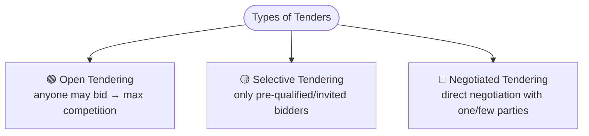
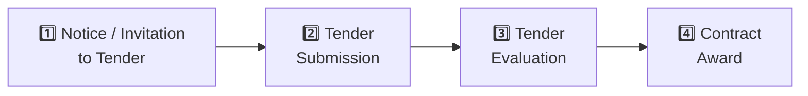
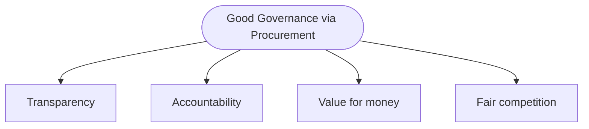

# 05 · Public Procurement & Tendering 📑

> Source: *Week 6 — Basics of the Tendering Process* (Eng. Sarath Wickramasuriya)
> Related: [Conflict of Interest](<../04 · Conflict of Interest/README.md>), [Professional Ethics](<../02 · Professional Ethics/README.md>)
> Quiz weight: 🎯🎯🎯🎯🎯 — **~10 questions on procurement principles & tendering.**

---

## 1. What is tendering?

> [!NOTE]
> **Tendering** = the process of **inviting bids** for large projects. In engineering it ensures **competition** and the selection of the **best contractors.**

---

## 2. Types of tenders

> [!WARNING]
> In the **assignment case (BetaConnect)**, a **restricted (selective) tender with a *reduced* tender period** produced **only one qualified vendor**, who then **failed the Proof of Concept.** Lesson: restricting competition *and* shortening time tends to produce **worse** outcomes on price, quality and fairness. Restricted tenders are only justified when the need is **highly specialised, the market is genuinely thin, or urgency is real.**

---

## 3. The tendering process (4 stages)

---

## 4. Tender documents (components)

> [!NOTE]
> A tender package typically contains:
> - **Invitation to Tender (ITT)**
> - **Instructions to Bidders**
> - **Technical Specifications**
> - **Bill of Quantities (BOQ)**
> - **Conditions of Contract**
> - **Forms for Submission**

---

## 5. Criteria for tender evaluation

| Criterion | Covers |
|---|---|
| **Technical** | Competence, materials, experience |
| **Financial** | Cost, payment terms |
| **Timeline** | Project completion time |

> [!IMPORTANT]
> The purpose of **evaluation criteria** is ==**to facilitate fair and objective evaluation of bids**== — *not* to favour vendors or to consider "only the lowest price."

---

## 6. Procurement principles & good governance 🏛️

> [!IMPORTANT]
> **Primary goal of public procurement:** ==**ensuring transparency and fairness in purchasing goods and services.**==
>
> **Key principles of public procurement:** **Accountability · Efficiency · Integrity · Transparency.**
> ⚠️ **Confidentiality is NOT a key principle** — this is a classic "which is NOT" answer.

Procurement contributes to **good governance** by ensuring ==**transparency, accountability, and value for money** in government spending.==

### Supporting concepts

- **Competition** ensures government agencies receive the **best value for money.**
- **Needs assessment** → identify the **specific requirements and objectives** of the procurement.
- **Contract management** → ensures contracts are **executed in accordance with agreed terms and conditions.**
- **Post-procurement reviews** → **identify areas for improvement** in the process.
- **RFQ (Request for Quotation)** → a procurement method that **promotes competition.** (Sole sourcing, direct & negotiated procurement do **not.**)

---

## 7. Tendering: legal requirements, risks & best practices

> [!NOTE]
> **Legal requirements:** fair competition · transparency · compliance with laws.

| Risks & challenges | Best practices |
|---|---|
| **Underbidding** | Carefully **review tender documents** |
| **Bid rigging** | **Clear communication** |
| **Incomplete tender submissions** | **Maintain transparency** |

---

## 8. Ethics in procurement ⚠️

> [!WARNING]
> The headline **unethical** behaviour in public procurement is ==**accepting bribes or kickbacks from vendors in exchange for awarding contracts.**==
> Contrast with **ethical** behaviour: transparent feedback to unsuccessful bidders, following procedures, and thorough market research. This links directly to [Conflict of Interest](<../04 · Conflict of Interest/README.md>).

---

## 9. Procurement quick-fire (exam reflexes)

> [!TIP]
> | Question theme | Correct answer |
> |---|---|
> | Primary goal of public procurement | **Transparency & fairness** in purchasing |
> | NOT a key principle | **Confidentiality** |
> | Role of competition | Agencies get the **best value for money** |
> | Needs assessment | Identify **specific requirements & objectives** |
> | Evaluation criteria | **Fair & objective** evaluation of bids |
> | Contract management | Contracts executed **per agreed terms** |
> | Post-procurement review | **Identify areas for improvement** |
> | Method that promotes competition | **RFQ** (Request for Quotation) |
> | Unethical behaviour | **Accepting bribes / kickbacks** |
> | Contribution to good governance | **Transparency, accountability, value for money** |
