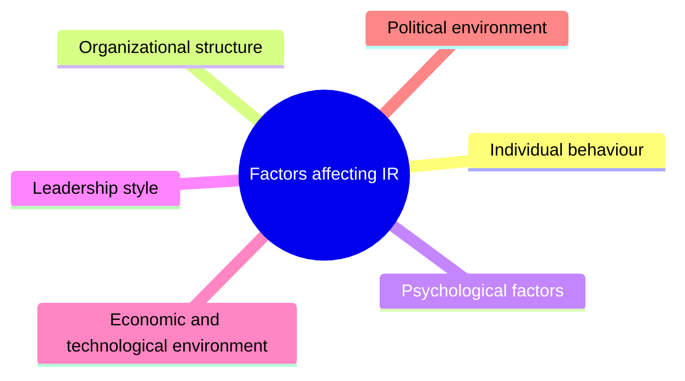
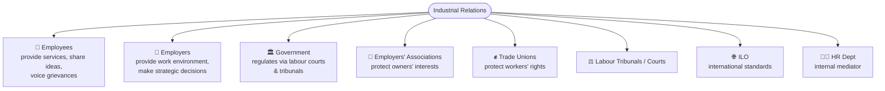
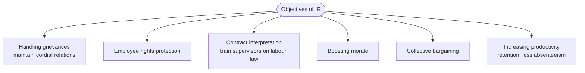
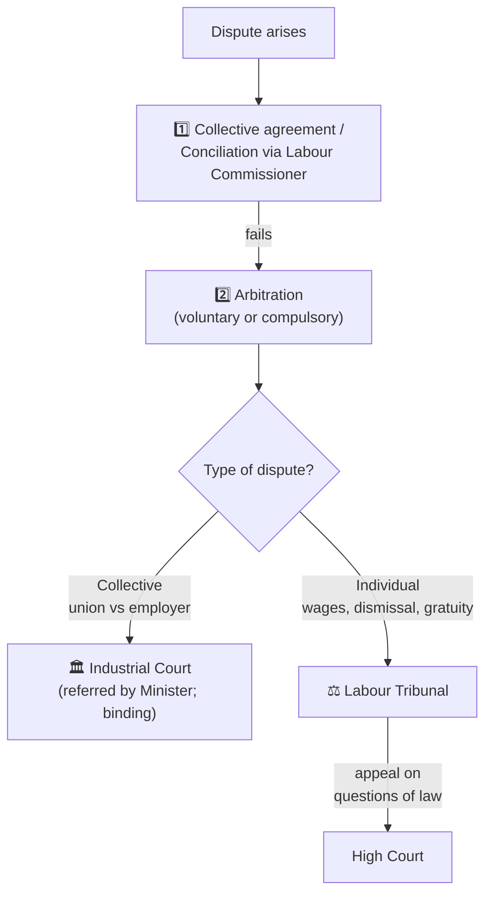

# 06 · Industrial Relations & Labour Law 👷⚖️

> Source: *Lesson 5 — Industrial Relations* (Eng. P. W. Sarath) + *Week 13 — Sri Lanka Labour Dispute Q&A*
> Related: [Workplace Safety](<../03 · Workplace Safety/README.md>), [Engineer & Society — Foundations](<../01 · Engineer & Society — Foundations/README.md>)
> Quiz weight: 🎯🎯🎯🎯 — labour-law definitions are reliably tested.

---

## 1. What is Industrial Relations (IR)?

> [!NOTE]
> **Industrial Relations** is the field of study that **analyses the relationship between management and employees** at the workplace and **provides a mechanism to settle industrial disputes.**
> - **Industry** = economic activity (manufacturing/producing/processing goods or services) by a group of individuals.
> - **Relations** = the connection & communication between employer and employees.

The concept evolved in the **late 19th century** because of the **industrial revolutions.** **John R. Commons** introduced the modern concept of industrial relations in **1920**, emphasising labour relations' impact on **productivity.**

---

## 2. Factors that affect industrial relations

| Factor | Effect |
|---|---|
| **Individual behaviour** | Different perception/background/skills → people behave differently, impacting the work environment. |
| **Organizational structure** | Hierarchy creates formal relationships; delegation of decision-making power shapes manager–employee relations. |
| **Psychological factors** | Employee's attitude to employer/task & employer's psychology toward workers (positive/negative) shape the relationship. |
| **Leadership style** | Formal/informal ways of building team spirit & motivating affect IR. |
| **Economic & technological env.** | Restructuring work duration/conditions/wages to match conditions changes attitudes. |
| **Legal & political env.** | Frames rules, rights, authority, roles & responsibilities of all parties. |

---

## 3. Stakeholders in industrial relations

| Stakeholder | Role |
|---|---|
| **Employees** | Essential resource; share views/suggestions, join decision-making, voice grievances & seek redress. |
| **Employers** | Provide a favourable work environment; have rights (lay-offs, mergers, acquisitions, tech change); must motivate, build trust, communicate, negotiate with unions. |
| **Government** | Since the 19th c. it regulates IR through **labour courts & tribunals** — to safeguard both parties and ensure legal compliance. |
| **Employers' associations** | Authoritative body protecting industrial owners; represents them in collective bargaining; helps resolve disputes. |
| **Trade unions** | Workers unite & elect representatives to protect rights & raise demands. **Examples: GMOA, Lanka Guru Sangamaya.** |
| **Labour tribunals / courts** | Resolve legitimate conflicts; avoid judicial flaws, conflicting judgments, poor penalties, confusing terms. |
| **ILO** (International Labour Organization, **1919**) | Sets international labour standards via the **International Labour Code (ILC)** — wages, hours, women's employment, safety/health, maternity protection. |
| **HR department** | Internal **mediator**; addresses disputes early; change agent; strategic partner. |

---

## 4. Key Sri Lankan labour Acts 🇱🇰

> [!IMPORTANT]
> Memorise these four — they're named in the lecture (and overlap with [Engineer & Society — Foundations](<../01 · Engineer & Society — Foundations/README.md>) and [Workplace Safety](<../03 · Workplace Safety/README.md>)):
> | Act / Ordinance | Purpose |
> |---|---|
> | **Industrial Disputes Act** | **Prevent, investigate, settle** disputes |
> | **Shop and Office Act** | Regulate employment, **working hours, remuneration** |
> | **Factories Ordinance** | **Safety & welfare** of workers in factories |
> | **Trade Union Ordinance** | **Registration** of trade unions |

---

## 5. Scope of industrial relations

| Scope | Meaning |
|---|---|
| **Employer–employee relationship** | Treat employees fairly; value efforts; use HR strategies (employee-relations programs, performance promotions, employee shareholding). |
| **Group relationships** | Interactions between workers of different workgroups; establish harmony among groups. |
| **Labour relations** | Relationship between managers and workers — behaviour, thoughts, actions, perceptions. |
| **Public relations** (community relations) | Org's interaction with society/external bodies; maintain cordial public ties for long-term existence. |

---

## 6. Objectives of industrial relations

> [!NOTE]
> **Collective bargaining:** worker representatives and management put proposals to each other and **negotiate** to reach a mutual decision, written into a **collective bargaining agreement.**

---

## 7. Labour-law concepts the quiz tests 🎯

> [!IMPORTANT]
> These four definitions appear almost verbatim as quiz answers:
> | Concept | Definition (correct answer) |
> |---|---|
> | **Collective bargaining** | Negotiating employment contracts **between *groups* of employees and their employers** (not individuals, not in court). |
> | **Employment-at-will** | **Employers have the right to terminate employees at any time and for any reason.** |
> | **Minimum wage laws** | **Guarantee a living wage for all workers.** |
> | **Anti-discrimination laws** | **Prevent unfair treatment based on protected characteristics** (race, gender, disability). |
> | **OHS regulations** | **Minimise workplace accidents and injuries.** |

---

## 8. Sri Lanka labour-dispute resolution procedure 🇱🇰

> [!NOTE]
> From the Week 13 Q&A — the path a dispute travels:

| Q | Key fact |
|---|---|
| First step | **Collective agreement / conciliation** through the **Labour Commissioner.** |
| Labour Commissioner's role | Facilitates **conciliation, voluntary arbitration**; can refer to **compulsory arbitration** or the **Industrial Court.** |
| If conciliation fails | **Arbitration** (voluntary/compulsory) or referral to **Industrial Court / Labour Tribunal.** |
| **Industrial Court** | Handles **collective** disputes (trade unions vs employers); referred by the **Minister of Labour**; decisions are **binding.** |
| **Labour Tribunal** | Handles **individual** disputes — wages, **dismissal, reinstatement, gratuity**, service conditions. |
| Tribunal timeline | Application forwarded to employer within **3 working days**; parties respond within **21 days.** |
| Appeal | To the **High Court**, limited to **questions of law.** |
| **Compulsory arbitration** | Minister of Labour mandates an arbitrator/panel when voluntary methods fail. |
| ADR | **Mediation & conciliation** are recognised. |
| Protections | The **Industrial Disputes Act** prohibits forcing union membership, **victimisation**, and **unfair dismissal.** |

> [!TIP]
> Quick memory hook: **Individual** dispute → **Labour Tribunal**; **Collective** dispute → **Industrial Court.** Both start with **conciliation by the Labour Commissioner.**
