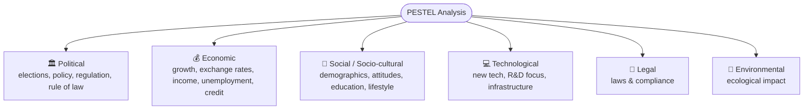
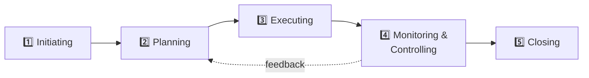
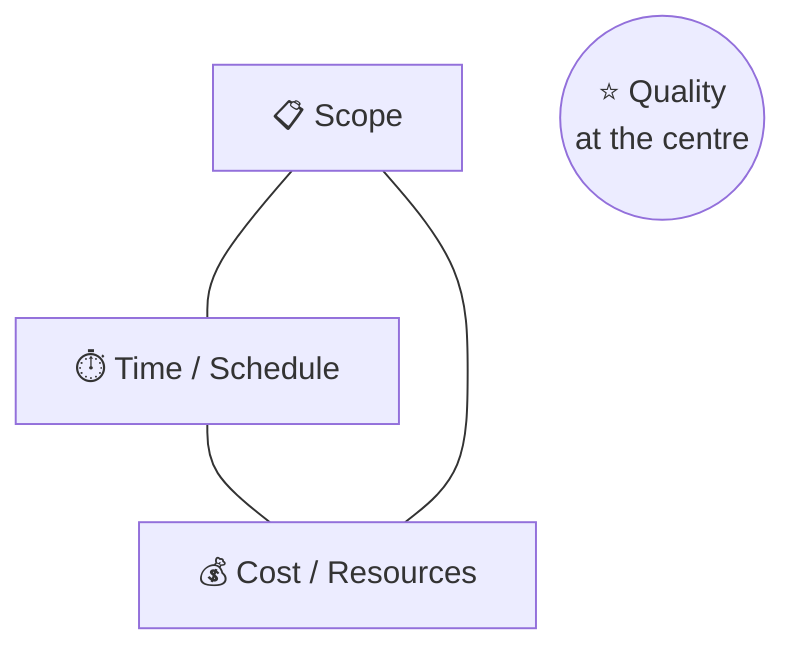
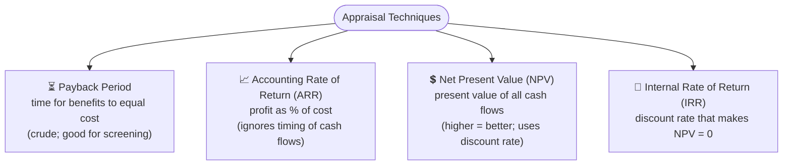

# 07 · Planning & Project Management 📊

> Source: *Week 13 — Ruhuna Lecture 1: Planning and Management for Engineers*
> Related: [Engineer & Society — Foundations](<../01 · Engineer & Society — Foundations/README.md>), [Case Studies Compendium](<../08 · Case Studies Compendium/README.md>)
> Quiz weight: 🎯🎯 — lighter in the MCQ bank, but core to the **module's learning outcomes** and the assignment.

---

## 1. Module learning outcomes (context)

> [!NOTE]
> This lecture maps to the module LOs: explain **planning & management** concepts; evaluate **social, legal & economic viability** of a project; describe **ethical responsibilities**; produce effective **oral/written communication**; apply planning & management to a **real-life project.**

**Industry** (definitions): a group of productive enterprises/companies related by their **primary business activities**, grouped into **sectors.**

---

## 2. PEST / PESTEL analysis 🌍

> [!IMPORTANT]
> **PEST = Political, Economic, Social, Technological.** Extended versions:
> - **PESTLE / PESTEL** → adds **Legal, Environmental**
> - **PESTLIED** → adds Legal, International, Environmental, Demographic
> - **STEEPLE** → adds Environmental, Legal, **Ethical**
> - **SLEPT** → Socio-cultural, Legal, Economic, Political, Technological
> - **LONGPESTLE** → Local, National, Global versions (for multinationals)

> [!NOTE]
> Related distinction: **Output** (what is produced) vs **Outcome** (the change/result) vs **Benefit** (value realised, & beneficiaries).

---

## 3. What is a Project?

> [!IMPORTANT]
> A **project** is a ==**temporary endeavour**== that produces a unique **product, service, or result**, with a **definite beginning and end.**
> ⚠️ "Temporary" does **NOT** mean "short duration."

A project **ends** when: objectives are achieved · objectives cannot/will not be met (terminated) · the need no longer exists.

**Example outcomes:** new product/service/result · process/staffing/structure change · new/modified information system (CRM/ERP) · a research effort · constructing a building/plant/infrastructure · business process re-engineering.

---

## 4. The 5 process groups (phases)

**Actions in managing a project:** identify requirements · address stakeholders' needs/concerns/expectations · set up & maintain **active, effective, collaborative communication** · manage stakeholders toward meeting requirements & creating deliverables.

---

## 5. The Iron Triangle (triple constraint) 🔺

> [!IMPORTANT]
> The classic **iron triangle**: **Scope · Cost (Resources) · Time** — with **Quality** at the centre. Change one and the others must adjust. The broader balancing set: **Scope · Quality · Schedule · Budget · Resources · Risks.**

> [!TIP]
> The lecture's joke version: *"How much will it cost?" → "As much as you're willing to spend." "How long?" → "As long as necessary." "What will I get?" → "Whatever you tell us you want."*

### Strategies for project constraints

| Constraint fixed | Strategy |
|---|---|
| **Fixed cost** | Work in customer-priority order; short 1–2 week sprints; monitor velocity & burn rate. |
| **Fixed time** | Work in business-value order; enforce sprint duration. |
| **Fixed cost + scope** | Increase estimated risk in Sprint 0; update delivery date as needed. |
| **Fixed cost + time** | Calculate total cost as cost-per-sprint. |
| **Fixed time + scope** | Pre-assign work in Sprint 0; pad schedule; grow the team near the end. |
| **Fixed cost + time + scope** | **No flexibility → cancel** (not an agile project; use waterfall e.g. PRINCE2). |

> [!NOTE]
> **Traditional vs Agile:** in the iron triangle, traditional/waterfall **fixes scope** and flexes time/cost; **agile fixes time & cost** and flexes scope.

---

## 6. Investment Appraisal 💵

> [!NOTE]
> **Investment appraisal** = techniques to judge the attractiveness of an investment. Goals: **assess viability** of objectives & **support the business case.** Done **early** in a project/programme, in parallel with planning. At its heart: a **comparison between investment and return** (both measured in **cash**).

| Technique | Key point |
|---|---|
| **Payback method** | Time taken for benefits to equal cost. Crude, but useful for **initial screening.** |
| **Accounting Rate of Return (ARR)** | Profit as a **% of costs**; **does not** account for the **timing** of income/expenditure. |
| **Net Present Value (NPV)** | Present value of all cash flows using a **discount rate**; **higher NPV = better.** Best when there's a time gap between spend & return (discounted cash flow). |
| **Internal Rate of Return (IRR)** | The discount rate giving an **NPV of zero.** Used to compare alternatives. |

> [!NOTE]
> **Factors beyond cash flows:** legal/compulsory requirements, environmental impact, social impact (e.g. "lives saved"), operational benefits (morale, customer satisfaction), and **risk reduction.**

**Two key steps:** (1) **collect relevant information** (with stakeholders, top-down or bottom-up); (2) **perform the appraisal** with suitable techniques → report as a **business case.**

---

## 7. Project life cycle & charter

**Life cycle:** Starting the project → Organising & preparing → Carrying out the work → Closing the project.

> [!NOTE]
> **Develop Project Charter** — needs a **Business Case** driven by: market demand · organisational need · customer request · technological advance · legal requirement · ecological impact · social need.

**Tools:**
- **Expert judgement** — from other units, consultants, stakeholders, professional/technical associations, industry groups, subject-matter experts, the **PMO.**
- **Facilitation techniques** — brainstorming · conflict resolution · problem solving · meeting management.

> [!TIP]
> For the assignment/long-answer side: tie project management to **ethics** — e.g. balancing the iron triangle should **never** sacrifice **safety** or **quality** to hit cost/time (see **Uma Oya** & **Meethotamulla** in [Case Studies Compendium](<../08 · Case Studies Compendium/README.md>)).
