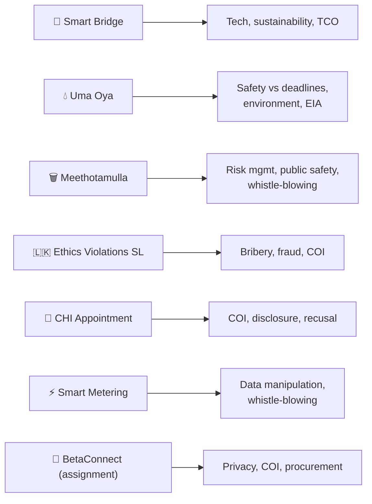

# 08 · Case Studies Compendium 📂

> Source: Week 2, 4 & 5 case-study materials + the Part-1 group assignment
> Purpose: each case **illustrates** a principle from notes 02–07. Useful for the assignment and any scenario-style quiz question.

---

## Quick map

---

## 1. 🌉 Smart Pedestrian Bridge (Week 2 & 4)

> [!NOTE]
> A smart pedestrian bridge using **advanced materials + embedded computing**, focused on **safety, sustainability, real-time monitoring.**

- **Computer engineers:** embedded control (lighting/alerts), IoT dashboards, wireless status updates.
- **Materials engineers:** corrosion-resistant lightweight composites — **FRP** & **weathering steel**; durability/fatigue evaluation.
- **Management practices:** interdisciplinary planning (**Gantt charts**), **risk assessment**, cost management, recycled/eco materials, **ISO quality assurance.**
- **Outcome:** load/temp/vibration sensors + real-time dashboard; FRP & weathering steel; **completed under budget & on time.**

**Key insights:**
- Embedded systems improve safety via **real-time monitoring + predictive maintenance** (logging sensor data to catch early fatigue).
- **Cost vs performance:** assess **Total Cost of Ownership (TCO)**, not just build cost.
- **Sustainability add-ons:** solar lighting, **piezoelectric kinetic-energy harvesting**, AI traffic monitoring, rainwater harvesting, green materials.

> [!TIP]
> **Piezoelectric tiles** (Week 4): generate electricity from foot pressure (piezoelectric effect). Output is low (**~100–246 mW/step**), high cost — best paired with **solar** for LED lighting/sensors. Commercial example: **Pavegen (UK), Energy Floors (NL).**

---

## 2. 💧 Uma Oya Multipurpose Development Project (Week 5)

> [!NOTE]
> Large hydroelectric + irrigation scheme in Sri Lanka — **120 MW** hydropower, irrigation & drinking water. 3.9 km headrace tunnel, two reservoirs, underground power station (2×60 MW).

| Issue | Detail |
|---|---|
| **Geotechnical** | Water seepage, ground subsidence |
| **Environmental** | Reduced water in upper basin, biodiversity loss |
| **Social** | 4,000+ families affected, inadequate compensation |
| **Ethical dilemma** | Public safety **vs** deadlines; environment **vs** development; integrity **vs** management pressure |

**Outcome:** cost overruns, persistent water scarcity, protests & legal action, → **stricter EIA enforcement.**

> [!IMPORTANT]
> Engineer's duty when harm is discovered: **report to authorities, suggest mitigation, and suspend harmful activities.** Improve the **EIA** (Environmental Impact Assessment) process with independent review & post-EIA monitoring.

---

## 3. 🗑️ Meethotamulla Garbage-Dump Collapse (Week 5) — safety/ethics failure

> [!WARNING]
> Colombo's largest open dump — **23 million tonnes**, **70–90 ft high** (well above safe limits). On **14 April 2017** (New Year), after heavy rains it **collapsed**: ==**32 deaths, 1,000+ displaced, 145 houses destroyed.**==

**Ethics violations:** neglecting public safety (ignored years of warnings) · failing engineering standards (unsafe slope, no stability assessment) · lack of transparency · **conflict of interest** (dumping continued due to political pressure).

**Root causes:** poor risk management; failure to act on geotechnical/environmental assessments; weak enforcement of municipal codes.

> [!IMPORTANT]
> - **Risk tools that could have prevented it:** slope stability analysis, hydrological impact studies, geotechnical soil testing, leachate drainage modelling.
> - **If pressured to ignore a hazard:** escalate, document findings, **refuse to certify** unsafe operations, report to regulators.
> - **Consequences:** criminal liability for negligence, loss of licence, loss of public trust, imprisonment.

---

## 4. 🇱🇰 Violations of Professional Ethics in Sri Lanka (Week 4)

Common engineering-context violations: **bribery & corruption in procurement · conflict of interest in awarding contracts · misuse of public resources · plagiarism/falsified qualifications · bypassing technical standards.**

| Case | Violations | Impact |
|---|---|---|
| **Construction corruption scandal** (govt bridge) | Manipulated tender, bribes for certification, substandard materials | Structural failure, financial loss, public distrust |
| **Qualification fraud** (senior technical role) | False qualifications, invalid board memberships | Poor decisions, qualified people sidelined, no accountability |

**Lessons for future engineers:** follow professional codes · report unethical behaviour · be transparent & competent · stay informed. **International comparison:** stronger ethics systems abroad — **licensing, regular audits/training, transparent procurement.**

---

## 5. 👔 Conflict of Interest in Appointments — CHI (Week 5)

> See full write-up in [Conflict of Interest](<../04 · Conflict of Interest/README.md>) §7. Committee chair championed her **nephew** without recusing → favouritism, lost credibility, investigation. **Fix:** COI policy, **mandatory recusal**, independent committee, training, audits.

---

## 6. ⚡ Fictitious Smart-Metering Ethics Violation (Week 5) — ECE-focused

> [!NOTE]
> **ABC Power Solutions** installs 50,000 smart meters for the **DEF Electricity Board.** A subcontractor inserted **hidden code** that cut bills by up to **70% for "VIP accounts"** (politicians, executives). A whistle-blowing engineer was told to *"leave it alone — approved at higher levels."*

**Violations:** data manipulation · breach of public trust · failure to act on whistle-blower reports · **conflict of interest** (favouring connected clients).

> [!IMPORTANT]
> - **Engineer's correct steps:** document evidence → report internally → escalate to an **independent oversight body** → use **whistle-blower protection** if retaliated against.
> - **Technical safeguards:** secure version control with **signed commits**, **role-based access control**, automated **code-integrity checks**, **blockchain audit trails**, intrusion detection, binary-vs-source **hashing.**
> - **Consequences:** disciplinary hearing under the engineering code; prosecution under the **Computer Crimes Act** & anti-corruption laws; licence revocation, fines, contract termination.

---

## 7. 🔐 BetaConnect Ltd. — the Part-1 Group Assignment case

> [!NOTE]
> A Sri Lankan digital-services company leaks customer data to an insurer. The internal investigator (**Mr Y**) had an **undisclosed close relationship** with the suspected leaker. Investigation concluded "no one can be traced." Then a **restricted tender with a reduced period** to buy a governance system yielded **one vendor**, who **failed the PoC.**

This case is a **capstone** — it tests every theme at once:

| Assignment part | Ties to note |
|---|---|
| (a) Ethical issues (data misuse, broken promise, untraceable access, biased investigation) | [Professional Ethics](<../02 · Professional Ethics/README.md>) |
| (b) COI of Mr Y + importance of **disclosure** | [Conflict of Interest](<../04 · Conflict of Interest/README.md>) |
| (c) Technical **vs** management failure (no audit logs/RBAC **and** no governance mandate) → **both** | [Planning & Project Management](<../07 · Planning & Project Management/README.md>) |
| (d) Procurement evaluation (restricted tender + short window = weak competition) | [Public Procurement & Tendering](<../05 · Public Procurement & Tendering/README.md>) |
| (e) Preventive measures (engineering / organisational / ethical) | All of the above |

> [!IMPORTANT]
> **Model preventive measures** (from our submission):
> - **Engineering:** immutable **audit logs**, **role-based access control**, **data-loss-prevention (DLP)** software.
> - **Organisational:** independent breach investigations; a strict, transparent, competitive procurement process with real PoC testing.
> - **Ethical:** **annual + immediate COI disclosures**, anonymous whistle-blowing channels, continuous data-handling training.

> [!TIP]
> **The golden thread across all cases:** ==public safety first · disclose conflicts · be transparent · build traceability/accountability into systems · never let deadlines, profit, or pressure override ethics.==
