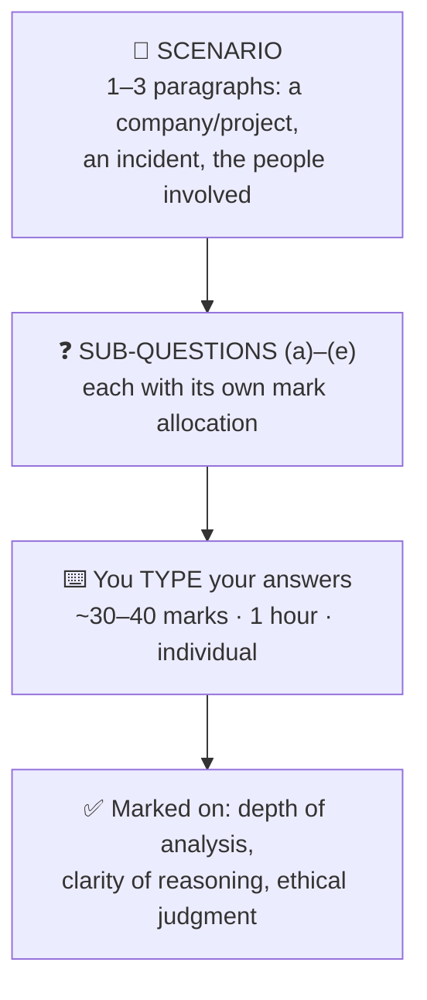
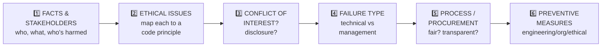
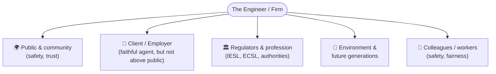

# 10 · Case Study (Part 2) — In-Class Exam Guide 📝

> [!IMPORTANT]
> **Assessment overview**
> - The 2-hour block holds **two individual assessments**:
>   1. **Computer-based quiz — 40%** (the 50-question bank → see [Quiz Concept Bank](<../Quiz Concept Bank — CA 2 Prep/README.md>))
>   2. **Case Study (Part 2) — 30%** — *in-class, computer-based, **UNSEEN** written question, answered within **1 hour**, individual.*
> - This note is **only about #2** — the 1-hour written case study.

> Related revision: [Professional Ethics](<../02 · Professional Ethics/README.md>) · [Workplace Safety](<../03 · Workplace Safety/README.md>) · [Conflict of Interest](<../04 · Conflict of Interest/README.md>) · [Public Procurement & Tendering](<../05 · Public Procurement & Tendering/README.md>) · [Industrial Relations & Labour Law](<../06 · Industrial Relations & Labour Law/README.md>) · [Case Studies Compendium](<../08 · Case Studies Compendium/README.md>)

---

## 1. What a "case study" is — and why engineers are tested on it

> [!NOTE]
> A **case study** is a **realistic scenario** in which an engineer (or firm) faces a **decision, dilemma, or failure.** You are asked to **analyse** it — identify the issues, apply engineering & ethical principles, and **justify** a responsible course of action.

From the lecturer's own Week 5 framing, case studies exist so you can:
- **Taste real-world situations & dilemmas** engineers face;
- Learn to **apply your ethics knowledge** in practical situations;
- Learn to **relate Codes of Ethics** to make correct decisions.

> [!IMPORTANT]
> There is usually **no single "right answer."** Marks come from the **quality of your reasoning and ethical judgment.** The lecturer literally states marks are for *"depth of analysis, clarity of reasoning, and ethical judgment — **not for length**."*
> The four things that shape a good answer: ==**knowledge of ethics · analytical power · judgement · experience.**== (STANDARDS · SENSITIVE · JUDGEMENT · WILL-POWER — see [Professional Ethics](<../02 · Professional Ethics/README.md>).)

---

## 2. The format you should expect 🧱

We don't have the Part 2 paper (it's unseen), but the lecturer's **Part 1** assignment shows his exact style. Expect:



> [!NOTE]
> **Likely structure (based on Part 1):**
> - One scenario, then **3–5 sub-questions**, each worth a stated number of marks (Part 1 used **10 / 8 / 8 / 6 / 8 = 40**).
> - Total likely **~30–40 marks** answered in **60 minutes** → budget roughly **1–1.5 min per mark.**
> - You may be allowed to use **diagrams, tables, flowcharts** and must **state any assumptions.**

> [!WARNING]
> The lecturer explicitly warns: ==**"Mere repetition of the case study will not be awarded marks."**== Don't retell the story — **analyse** it. Every sentence should add reasoning, a principle, or a judgment.

---

## 3. The 6 question archetypes 🎯

Almost every sub-question in this module is a variant of one of these. Learn the "move" for each:

| Archetype | What they're really asking | Your move | Draw on |
|---|---|---|---|
| **1. Identify & discuss the ethical issues** | Spot every issue + explain *why* it's wrong | Name issue → link to a **code principle** → say who is harmed | [Professional Ethics](<../02 · Professional Ethics/README.md>) |
| **2. Was there a conflict of interest? + disclosure** | Apply the COI test; argue importance of disclosure | "COI = judgment *could appear* compromised" → **Identify→Disclose→Manage** | [Conflict of Interest](<../04 · Conflict of Interest/README.md>) |
| **3. Technical vs management failure (or both)** | Classify the root cause | Argue **both**: the system lacked X *and* management failed to mandate/oversee X | [Planning & Project Management](<../07 · Planning & Project Management/README.md>) |
| **4. Evaluate the procurement / process** | Judge fairness, competition, transparency | Test against **transparency, competition, value-for-money**; flag restricted/rushed tenders | [Public Procurement & Tendering](<../05 · Public Procurement & Tendering/README.md>) |
| **5. What should the engineer do? / safety duty** | The responsible action under pressure | **Public safety paramount** → document → escalate → refuse to certify → whistle-blow | [Workplace Safety](<../03 · Workplace Safety/README.md>) |
| **6. Propose preventive measures** | Fix it at every level | Split into **Engineering / Organisational / Ethical** (the "EOE" split) | All notes |

> [!TIP]
> If a question type surprises you, fall back to **stakeholders + public safety + transparency**. Ask: *who is harmed, what duty was breached, what would a responsible engineer do?* That structure earns marks on **any** prompt.

---

## 4. How to THINK — the 6-Lens analysis method 🔍

When you read the scenario, pass it through these six lenses **in order**. This is your planning skeleton.



> [!IMPORTANT]
> **The ethical core that overrides everything** (memorise — it decides the hard parts):
> 1. <span style="color:#2e7d32">**Public safety, health & welfare is paramount**</span> (IESL Principle 1 / NSPE Canon 1).
> 2. **Identify → Disclose → Manage** every conflict of interest.
> 3. **Transparency & honesty** over secrecy; **truthful** statements only.
> 4. **Sustainability** & the precautionary principle for the environment.
> 5. Duty order in a dilemma: ==**public & environment > client/employer > self.**==

### A quick stakeholder map you can reuse



---

## 5. How to WRITE — structure & technique ✍️

### 5.1 Answer each sub-part with the **C-A-S-E** micro-structure

> [!TIP]
> For every point you make:
> - **C — Claim:** state your position in one sentence. *("This is a conflict of interest.")*
> - **A — Apply principle:** name the engineering/ethical principle or code clause. *("A COI exists whenever judgment could reasonably appear compromised…")*
> - **S — Support with the case:** quote the specific fact from the scenario. *("…and Mr Y had an undisclosed relationship with the suspect.")*
> - **E — Effect/conclude:** the consequence or what should be done. *("So the outcome can never look independent; he should have disclosed and recused.")*

### 5.2 Presentation rules (it's typed / computer-based)

- **Label every part clearly:** `(a)`, `(b)`, `(c)`… so the marker can find each answer.
- **One idea per short paragraph**, led by a **topic sentence.**
- **Name principles and codes** explicitly — *"public safety is paramount (IESL Principle 1)."* This is the single biggest mark-getter.
- **State assumptions** in one line if the scenario is silent on something.
- A small **table or list** is fine for "preventive measures" or "stakeholders" — but analysis questions need **prose with reasoning.**
- **Don't repeat the scenario.** Reference a fact only to *use* it.
- Leave **5 minutes to proofread** typos and check you answered **every** sub-part.

### 5.3 Reusable answer template

> [!NOTE]
> Paste this mentally onto any case. Replace the brackets.
>
> ```
> (a) Ethical issues
>     - Issue 1: [name] — breaches [principle/code]; harms [stakeholder].
>     - Issue 2: [name] — ...
>     - (brief judgment sentence tying them together)
>
> (b) Conflict of interest / disclosure
>     - Apply the COI test → state yes/no and WHY.
>     - Why disclosure matters: independence must also LOOK independent.
>     - What should have happened: disclose → recuse / independent panel.
>
> (c) Technical vs management failure
>     - Technical gap: [no audit logs / no stability check / no QA ...].
>     - Management gap: [didn't mandate, didn't oversee, rushed, ignored warnings].
>     - Conclusion: BOTH — design & governance are linked.
>
> (d) Process / procurement evaluation
>     - Test vs transparency, competition, value-for-money.
>     - Flag: restricted tender, short window, single bidder, failed PoC.
>     - Recommend: re-tender / open competition / proper evaluation.
>
> (e) Preventive measures (E-O-E)
>     - Engineering: [audit logs, RBAC, fail-safes, factor of safety, monitoring].
>     - Organisational: [independent review, transparent procurement, audits].
>     - Ethical: [mandatory COI disclosure, whistle-blower channel, training].
> ```

---

## 6. Time management for the 60 minutes ⏱️

| Phase | Time | What to do |
|---|---|---|
| **Read & annotate** | ~8–10 min | Read twice. Underline facts, people, dates, money, warnings. Note the marks per part. |
| **Plan** | ~5 min | Jot 2–4 bullet points per sub-part using the **6 lenses.** |
| **Write** | ~38–40 min | Answer **by marks** (≈1–1.5 min/mark). Do the **highest-mark** part well; don't over-write low-mark parts. |
| **Review** | ~5 min | Check every part is answered, principles are named, assumptions stated, typos fixed. |

> [!WARNING]
> The classic exam failure is **spending 30 minutes on part (a)** and rushing (d) and (e). **Watch the mark weights.** A 6-mark part should not get more words than a 10-mark part.

---

## 7. Common mistakes to avoid ❌

> [!WARNING]
> | Mistake | Fix |
> |---|---|
> | Retelling the story | **Analyse** — every line adds a principle/judgment |
> | Vague morality ("it's bad") | Name the **specific code clause** & **stakeholder harmed** |
> | Ignoring mark weights | Allocate words/time **by marks** |
> | Only blaming technology *or* management | Argue **both** and show they're linked |
> | Forgetting preventive measures structure | Use **Engineering / Organisational / Ethical** |
> | Picking "employer first" in a dilemma | **Public & environment come first**, always |
> | No assumptions stated | Add one line: *"Assuming the engineer is IESL-chartered…"* |
> | Leaving a sub-part blank | Even 2 reasoned sentences earn marks — **attempt everything** |

---

> [!IMPORTANT]
> 👇 Below are **3 full worked examples** (general engineering, Sri Lanka context) with **model answers** in the style and structure your marker expects. Treat them as both *content revision* and *writing templates.*

---

# 🧪 Worked Example 1 — "The Marine Drive Flyover"
### Theme: tender corruption · conflict of interest · falsified tests · safety vs deadline

> [!NOTE]
> **Scenario.** A government-funded highway flyover is being built by *Apex Constructions (Pvt) Ltd* and supervised by consultant *CivilTech Associates.* Eng. **Nimal** is the Resident Engineer (RE) employed by CivilTech to supervise quality on site.
>
> Midway through, Apex falls behind schedule. To recover, Apex proposes substituting a **cheaper, lower-grade steel reinforcement** for the specified grade, claiming it is "practically equivalent." Around the same time, Nimal notices that several **concrete cube test certificates appear duplicated**, with the same readings copied across different pours.
>
> It is also informally known that Apex's director is the **brother-in-law of a senior RDA official who sat on the tender evaluation board** that awarded the contract. This relationship was never declared.
>
> With the financial year ending, CivilTech's project manager pressures Nimal to **certify a completed bridge pier so the next payment is released on time.** A site supervisor privately warns Nimal that the pier's **formwork was struck (removed) too early**, before the concrete reached adequate strength.
>
> **Questions** *(40 marks)*
> **(a)** Identify and discuss the ethical issues raised in this case. *(10)*
> **(b)** Analyse whether a conflict of interest existed on the tender board, and explain the importance of disclosure in professional engineering practice. *(8)*
> **(c)** Do the falsified test certificates and early formwork removal represent a technical failure, a management failure, or both? *(7)*
> **(d)** Evaluate the decision to certify the pier to release payment before year-end. What should Nimal do? *(7)*
> **(e)** Propose engineering, organisational and ethical measures to prevent recurrence. *(8)*

---

### ✅ Model Answer — Example 1

> [!TIP]
> *Notice how each part names a principle, cites a fact from the case, and ends with a judgment — the **C-A-S-E** structure.*

**(a) Ethical issues *(10)***

Several distinct ethical failures are present, and each maps to a clause of the engineering code.

First, the proposed **material substitution** to a lower-grade steel directly threatens **public safety**, which is paramount under IESL Principle 1 (and NSPE Canon 1). A flyover carries live traffic loads; substituting reinforcement to recover time prioritises schedule and cost over the safety of the public who will use the structure. Even if Apex genuinely believes the steel is "equivalent," the decision is being driven by delay recovery, not by engineering judgment, which makes it unethical.

Second, the **falsified concrete test certificates** are a breach of honesty and integrity — engineers must "speak out objectively and truthfully" (IESL Principle 7) and avoid deceptive acts (NSPE Canon 5). Duplicated test readings mean the structure's actual strength is unknown, so the public is exposed to a hidden risk they cannot detect.

Third, the **undisclosed family relationship** between Apex's director and an RDA tender-board member is a conflict of interest that undermines the fairness of the award and the proper use of public funds (IESL Principle 1 also covers proper utilisation of resources).

Fourth, the **pressure to certify the pier** for payment asks Nimal to compromise his professional judgment for a financial deadline, conflicting with his duty to act as a faithful agent *without* conflict to the public interest (IESL Principle 6).

Taken together, the case shows safety, honesty, fairness and professional independence all being subordinated to cost and schedule — the recurring pattern of engineering ethics violations.

**(b) Conflict of interest on the tender board + importance of disclosure *(8)***

Yes — a conflict of interest clearly existed. A COI does **not** require proof that the official actually favoured Apex; it exists whenever a decision-maker's **judgment could reasonably appear to be compromised** by a personal interest. A tender-board member evaluating a contract bid from his **brother-in-law's company** meets that test instantly, because the public cannot be confident the award was made on merit.

The failure here was specifically the **non-disclosure**. Had the official declared the relationship, the board had legitimate options: he could **recuse himself** from that evaluation, an independent member could replace him, or the reasoning for proceeding could at least be documented. Any of those would have protected the integrity of the process. Staying silent removed all of them and tainted the award even if the bid was genuinely the best.

Disclosure matters in engineering practice because **independence must not only exist, it must be seen to exist.** Public trust in infrastructure spending depends on procurement being demonstrably fair. Disclosure is also far cheaper than the alternative: once a hidden relationship surfaces, the project, the official's reputation, and the profession's credibility all suffer — regardless of whether any actual bias occurred. The professional rule is therefore **Identify → Disclose → Manage** *before* the decision, not after.

**(c) Technical failure, management failure, or both? *(7)***

This is **both**, and the two are linked.

It is a **technical failure** because quality-assurance controls did not function as engineered. Concrete cube testing exists precisely to verify in-situ strength before load-bearing decisions; if certificates can be duplicated and accepted, the testing and verification system has no integrity. Striking formwork before the concrete gains adequate strength is a technical error in construction methodology that can cause cracking, deflection or collapse.

It is equally a **management failure**. Falsified certificates being accepted points to weak independent checking, document control and oversight — management did not enforce a verifiable QA chain. The early formwork removal reflects schedule pressure from management overriding curing requirements. Management also tolerated a culture where recovering time was more important than following specification.

The conclusion is that **design/technical controls and management responsibility are inseparable**: a control is only as good as the governance that enforces it. Blaming the site team alone would miss that management created the conditions for the shortcuts.

**(d) Evaluate certifying the pier for payment + what Nimal should do *(7)***

Certifying the pier simply to release a year-end payment would be **professionally indefensible.** Certification is a technical statement that the work meets specification; using it as a financial convenience converts an engineering judgment into an accounting one. With a credible warning that formwork was struck too early, certifying now could endanger life and would breach the duty to hold public safety paramount.

Nimal should:
1. **Refuse to certify** the pier until its integrity is independently verified.
2. **Document** everything — the supervisor's warning, the suspect certificates, the substitution proposal — in writing, with dates.
3. **Order verification testing** (e.g. core sampling / strength assessment of the pier) before any sign-off.
4. **Escalate** in writing to CivilTech's management and, because public safety and public funds are involved, to the client/RDA and the relevant authority (consistent with IESL 1.5/1.7 — when judgment on safety is overruled, inform the client/employer and the relevant authority).
5. Be prepared to **whistle-blow** to the regulator if the firm suppresses the concerns.

*Assumption: Nimal is a chartered engineer bound by the IESL code.* His short-term risk (friction with the PM) is outweighed by his duty to the public and his personal/professional liability if the pier later fails.

**(e) Preventive measures — Engineering / Organisational / Ethical *(8)***

**Engineering measures.** Require **independent, traceable material testing** (samples taken and sealed by the consultant, tested at an accredited lab, results logged against unique pour IDs to stop duplication). Enforce **hold-points** in the construction methodology — formwork may not be struck until concrete strength is independently confirmed. Build in appropriate **factors of safety** and reject non-specified materials unless formally re-designed and approved.

**Organisational measures.** Establish a **transparent, competitive tender process** with mandatory COI declarations for every board member and audited award decisions. Separate the **certification-for-payment** function from schedule/commercial pressure so engineers certify on merit. Conduct **regular independent QA audits** of test records.

**Ethical measures.** Make **conflict-of-interest disclosure mandatory and immediate** for all staff and board members, with recusal rules. Provide a **protected, anonymous whistle-blower channel** so engineers can raise safety concerns without fear of retaliation. Run **continuous ethics and safety training** so that "public safety is paramount" is a lived norm, not a poster.

> [!TIP]
> *This single case touches Ethics (note 02), COI (04), Procurement (05), Safety (03) and Failure analysis (07) — exactly how an integrated exam question behaves.*

---

# 🧪 Worked Example 2 — "The Kalu Ganga Water Supply & Mini-Hydro Scheme"
### Theme: environmental & social responsibility · ethical dilemma · EIA · truthful reporting

> [!NOTE]
> **Scenario.** A large multipurpose scheme combines a water-supply intake with a mini-hydro plant, including a **headrace tunnel** through hilly terrain. Eng. **Kavindi** is the project engineer for the implementing agency.
>
> During tunnelling, Kavindi observes that **groundwater is draining into the tunnel**, and **wells in three nearby villages are running dry.** The original **Environmental Impact Assessment (EIA)** assumed minimal hydrogeological impact and did **not** model this risk. Affected farmers protest; the compensation offered is widely seen as inadequate.
>
> The scheme has a **politically announced completion deadline.** Senior management instructs Kavindi to **continue at full pace** and to **sign an interim environmental-compliance report stating "no significant impact"** so that funding and approvals are not delayed. Management argues the water and power benefits to the wider region outweigh "a few wells."
>
> **Questions** *(40 marks)*
> **(a)** Identify the ethical issues and the competing duties Kavindi faces. *(10)*
> **(b)** Kavindi is asked to sign a report stating "no significant impact." Discuss her professional obligations and what she should do. *(8)*
> **(c)** Evaluate the adequacy of the EIA and risk-assessment process, and how it should be improved. *(7)*
> **(d)** How should an engineer balance development benefits against environmental and social responsibility? *(7)*
> **(e)** Recommend measures to prevent similar situations in future projects. *(8)*

---

### ✅ Model Answer — Example 2

**(a) Ethical issues and competing duties *(10)***

Kavindi is caught in a genuine **ethical dilemma**: a conflict between her duty to the **public, the affected community and the environment** on one side, and the instructions of her **employer** plus the wider regional benefit on the other.

The first ethical issue is **harm to the community**: villagers are losing their water supply, a direct impact on health and livelihood, which the project failed to anticipate. Under IESL Principle 1, public welfare is paramount, and the affected villagers are part of that public.

The second is **environmental responsibility and sustainability** (IESL Principle 3): groundwater depletion is an adverse environmental impact that engineers must minimise for present and future generations, applying the precautionary principle.

The third is the demand to **misreport** — signing a "no significant impact" statement that Kavindi knows to be false breaches the duty to be objective and truthful (IESL Principle 7 / NSPE Canon 3) and to avoid deceptive acts.

The fourth is the **inadequate EIA**, which means risk was not properly assessed before committing the works — a failure of professional diligence.

The competing-duties point is the heart of it: management frames this as benefits-for-many versus harm-to-few. But an engineer cannot resolve a safety/environmental harm purely by utilitarian arithmetic while also being asked to **conceal** the harm. The duty order is **public and environment first, employer second, self last.**

**(b) Obligations regarding the "no significant impact" report + what she should do *(8)***

Kavindi's overriding obligation is to be **truthful and objective** in professional statements. She **must not sign** a compliance report she knows is false; doing so would be a deceptive act, would expose the community to ongoing harm, and would make her personally and professionally liable.

Her professional course of action:
1. **Decline to sign** the inaccurate report and state her reasons in writing.
2. **Document** the observed groundwater drawdown, the drying wells, and the gap in the original EIA.
3. **Report the true findings** to management and, because the issue affects public welfare and the environment, **escalate to the relevant authority** (e.g. the Central Environmental Authority / project regulator) — consistent with the duty to inform the client/employer and, if overruled on a matter of public welfare, the relevant authority (IESL 1.5/1.7).
4. **Recommend mitigation** — see (c) — and propose **suspending or slowing the harmful activity** (tunnel grouting/sealing) until the impact is controlled.
5. Use **whistle-blower protection** if she faces retaliation.

She can still serve her employer faithfully (IESL Principle 6) — but only "with no conflict to the public interest." Honest reporting, not concealment, is how she does that.

**(c) Adequacy of the EIA and risk-assessment process *(7)***

The EIA was **inadequate** because it failed to model a foreseeable, high-consequence risk — hydrogeological impact from tunnelling on local groundwater — for a project whose whole premise is water. An EIA that omits the dominant local risk has not done its job.

Improvements:
- Conduct **detailed geotechnical and hydrogeological surveys** and **groundwater modelling** *before* construction, not after.
- Require **independent review** of the EIA rather than self-assessment by the proponent.
- Build in **continuous monitoring** during construction (well levels, seepage) with **trigger thresholds** that pause work.
- Mandate **post-EIA monitoring** and adaptive mitigation through the operational phase.
- Treat the EIA as a **living risk-management tool**, integrated with the project's risk register, not a one-off approval document.

**(d) Balancing development benefits with environmental & social responsibility *(7)***

An engineer should not treat "benefits versus environment" as a simple trade-off where one cancels the other. The professional approach is to **pursue the benefit while actively minimising and mitigating the harm**, and to be **transparent** about residual impacts.

Concretely this means: using **integrated water-resource management** so upstream abstraction does not starve downstream users; **genuine stakeholder consultation** with affected communities *before* decisions; **phased execution** so impacts are detected early and works can be adjusted; **fair and adequate compensation/resettlement** for those displaced or harmed; and applying the **precautionary principle** where impacts are uncertain. Sustainability (IESL Principle 3) requires weighing **future generations**, not just present output. Development that destroys a community's water security is not genuinely beneficial once the full social and environmental cost is counted — so the balance is struck by **redesigning and mitigating**, not by concealing harm.

**(e) Preventive measures — Engineering / Organisational / Ethical *(8)***

**Engineering measures.** Require rigorous **pre-construction hydrogeological surveys and modelling**; design tunnel **sealing/grouting** to limit groundwater ingress; install **real-time monitoring** of well levels and seepage with automatic work-stoppage thresholds; provide **alternative water supply** engineering for affected villages.

**Organisational measures.** Mandate **independent EIA review** and **independent environmental monitoring** separate from the delivery team; ensure **realistic schedules** so politically driven deadlines do not force concealment; establish a **stakeholder/grievance mechanism** with fair compensation; embed environmental hold-points in the project governance.

**Ethical measures.** Protect engineers' duty to report truthfully through a **whistle-blower policy** and a culture where raising environmental concerns is rewarded, not punished; require **ethics and sustainability training**; make **transparent public disclosure** of monitoring data so impacts cannot be quietly buried.

> [!TIP]
> *This case is modelled on the real **Uma Oya** project — see [Case Studies Compendium](<../08 · Case Studies Compendium/README.md>). Expect environmental/dilemma cases to reward the words: **public welfare paramount, sustainability, precautionary principle, EIA, stakeholder consultation, truthful reporting.***

---

# 🧪 Worked Example 3 — "The Export Factory Boiler"
### Theme: workplace safety · OHS law · safety-vs-production · industrial dispute

> [!NOTE]
> **Scenario.** Eng. **Ruwan** is the maintenance engineer at a large apparel-export factory. During a routine check he finds that the steam **boiler's pressure-relief valve is faulty**, the **emergency-stop is unreliable**, several operators have **no proper PPE**, and new workers received **no safety training.**
>
> Ruwan reports this to the plant manager and recommends shutting the boiler down for repair. The manager refuses: the factory is in its **peak export season**, and a shutdown would miss a major shipment. He tells Ruwan to *"keep it running and fix it after the order ships."*
>
> Meanwhile, the **workers' trade union**, aware of the conditions, demands immediate safety improvements and **threatens strike action.** Tension between workers and management is rising, and an **industrial dispute** is brewing alongside the physical safety risk.
>
> **Questions** *(40 marks)*
> **(a)** Identify the safety and ethical issues in this case. *(8)*
> **(b)** Under Sri Lankan law and OHS principles, what are the **employer's** and the **engineer's** safety responsibilities here? *(8)*
> **(c)** Ruwan is told to delay the repair until after the shipment. What should he do, and why? *(8)*
> **(d)** The trade union threatens strike action. Outline how this industrial dispute should be handled under the Sri Lankan procedure. *(8)*
> **(e)** Propose preventive measures (engineering / organisational / ethical). *(8)*

---

### ✅ Model Answer — Example 3

**(a) Safety and ethical issues *(8)***

The central issue is an **imminent threat to worker safety**: a faulty pressure-relief valve on a steam boiler is a potential explosion hazard, and an unreliable emergency-stop removes the last line of defence. Missing **PPE** and **untrained operators** compound the risk — these are exactly the physical, ergonomic and equipment hazards safety management exists to control.

Ethically, the instruction to "keep it running and fix it after the order ships" places **production and deadlines above human safety**, which directly violates the principle that **public and worker safety is paramount** (IESL Principle 1) and the rule that prioritising deadlines over safety is never an acceptable engineering responsibility.

There is also an **honesty/accountability** dimension — continuing to operate a known-unsafe boiler without informing workers exposes them to a hidden risk and breaches the duty of care. Finally, the deteriorating **employer–worker relationship** is an industrial-relations issue layered on top of the safety failure: ignoring legitimate safety grievances is what escalates disputes.

**(b) Employer's and engineer's safety responsibilities under SL law / OHS *(8)***

Sri Lankan workplace safety is governed primarily by the **Factories Ordinance** (safety and welfare of workers in factories), supported by occupational-safety standards and oversight bodies such as **NIOSH**. The objective of OHS regulation is to **minimise workplace accidents and injuries.**

The **employer's responsibilities** are to **provide a safe working environment** — safe plant and equipment, functioning safety systems, adequate **PPE**, proper **safety training**, hazard communication, and compliance with the Factories Ordinance. The employer cannot lawfully trade these duties against production targets.

The **engineer's responsibilities** are to **design and maintain with safety as a priority**, ensure **fail-safes** function (the relief valve and emergency-stop), report unsafe conditions, and **not certify or operate** equipment he knows to be unsafe. The engineer must also ensure **compliance with safety regulations and standards** and provide training/resources. Both parties share a duty; the employee/operator's complementary duty is to follow safety guidelines and report hazards — but that does not relieve the employer or engineer of theirs.

**(c) Delay the repair until after the shipment — what should Ruwan do? *(8)***

Ruwan should **refuse to keep the unsafe boiler in normal operation** and should **not** let the repair wait for the shipment. A pressure-vessel failure can kill; no export order justifies that risk, and "prioritising deadlines over safety" is precisely the action the profession rejects.

His correct steps:
1. **Document** the defects (relief valve, emergency-stop, PPE, training gaps) in writing, with the risk they pose.
2. **Formally notify** management in writing that operating the boiler is unsafe and recommend **immediate shutdown** or, at minimum, **isolation/derating** until repaired.
3. **Refuse to certify** the equipment as safe to run.
4. If management overrules him on a matter endangering life, **escalate** to higher management and to the **relevant authority** (Factory Inspectorate / labour authorities) — consistent with the duty to inform employer and authority when safety judgment is overruled.
5. Arrange **interim protections** if any operation continues (restricted access, PPE, supervision) and **immediate repair**.
6. Use **whistle-blower protection** if pressured or threatened.

*Assumption: a safe shutdown/repair window is technically feasible.* The professional principle is unambiguous: **public/worker safety is paramount over schedule and profit.**

**(d) Handling the industrial dispute under the Sri Lankan procedure *(8)***

The union's safety demand and strike threat should be handled through the **structured dispute-resolution process**, not by confrontation:

1. **Internal resolution / collective bargaining first** — management and the union (or the HR function as internal mediator) should negotiate directly; the workers' safety grievances here are legitimate and largely resolvable by fixing the hazards.
2. **Conciliation by the Labour Commissioner** — if internal talks fail, the first formal step is conciliation through the **Commissioner of Labour**, who facilitates dialogue between the parties.
3. **Arbitration** — if conciliation fails, the dispute may go to **voluntary or compulsory arbitration** (the Minister of Labour can mandate compulsory arbitration).
4. **Industrial Court** — a **collective** dispute between a trade union and the employer can be referred (by the Minister) to the **Industrial Court**, whose decision is **binding**. *(An individual worker's dismissal/wage claim would instead go to a **Labour Tribunal**.)*

Throughout, the **Industrial Disputes Act** protects workers against **victimisation and unfair dismissal** for raising the issue. The constructive path is for management to **address the safety grievance promptly**, which removes the dispute's root cause and restores the employer–employee relationship.

**(e) Preventive measures — Engineering / Organisational / Ethical *(8)***

**Engineering measures.** Implement a **planned preventive-maintenance** programme for the boiler and all safety-critical plant; ensure **fail-safes** (relief valves, emergency-stops, interlocks) are tested on schedule; provide and enforce **task-appropriate PPE**; install monitoring/alarms on the pressure system.

**Organisational measures.** Adopt a formal **safety-management system** compliant with the Factories Ordinance; make **safety training and drills** mandatory for all workers (including new hires); run **regular safety inspections and audits**; create a functioning **employer–worker safety committee** so grievances are heard before they become strikes; never set production targets that require bypassing safety.

**Ethical measures.** Build a **safety culture led by example** where every worker can stop unsafe work and **report hazards without fear** (protected whistle-blowing); make clear in policy that **safety overrides production deadlines**; provide ongoing **ethics and safety training** so the "safety is paramount" principle is embedded.

> [!TIP]
> *This case integrates Safety (note 03) and Industrial Relations / Labour Law (note 06). Safety + labour cases reward: **Factories Ordinance, NIOSH, safety paramount, refuse to certify, escalate, conciliation → arbitration → Industrial Court.***

---

## 11. Final 60-second checklist before you submit ✅

> [!IMPORTANT]
> - [ ] Answered **every** sub-part (a)–(e)? None left blank?
> - [ ] **Named principles/codes** (IESL Principle 1, NSPE canons, Factories Ordinance, etc.)?
> - [ ] Tied each point to a **specific fact** from the scenario (without just retelling it)?
> - [ ] Put **public/worker safety & environment first** in every dilemma?
> - [ ] On any COI → said **disclose + recuse**?
> - [ ] Preventive measures split into **Engineering / Organisational / Ethical**?
> - [ ] **Stated assumptions** where the case was silent?
> - [ ] Spent time **in proportion to the marks**?
> - [ ] Proofread for typos (it's typed)?
>
> **You've got this, Thejitha. 🍀**

