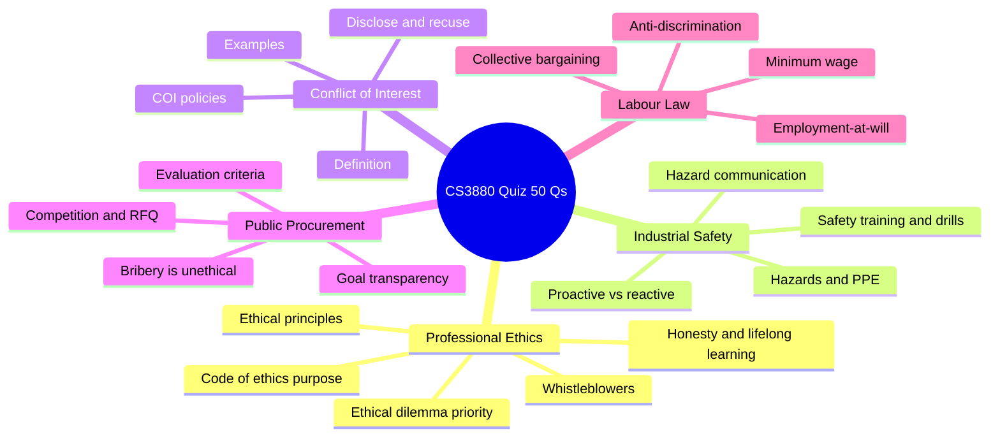

# 📚 Engineer & Society (CS/MT/ER 3880) — Notes

Comprehensive, exam-focused notes for the **Engineer & Society** module (Faculty of Engineering, University of Moratuwa). Built from **all** the lecture materials and cross-referenced against the **past-batch quizzes**, then re-grouped by topic (not one note per lecture PDF).

> [!IMPORTANT]
> The module is assessed by **two individual, computer-based parts**:
> 1. **Quiz — 40%** → drawn from a **fixed 50-question bank** (every past version reuses the same questions, just shuffled). → [**Quiz Concept Bank**](<Quiz Concept Bank — CA 2 Prep/README.md>)
> 2. **Case Study (Part 2) — 30%** → a **1-hour unseen written** question. → [**Case Study (Part 2) Guide**](<Case Study (Part 2) — In-Class Exam Guide/README.md>)

---

## 📁 Repository structure

Each note lives in its **own folder**. Inside every folder you'll find:

- **`README.md`** — the note itself. GitHub **auto-renders** this when you open the folder, so just click any folder below to read it.
- **An exported `HTML` file** — a standalone HTML version of the same note for offline viewing (generated locally with a Markdown-to-HTML converter).

The folders are **numbered `01`–`08` for the lecture topics** (read them in order). The **two exam-prep folders are unnumbered**, because they're study aids rather than lecture material.

> [!TIP]
> The notes use GitHub-flavoured **callouts** (Note / Tip / Warning / Important), **Mermaid diagrams**, colour and highlighting — all of which render directly on GitHub. For the richest view (with `[[wikilink]]`-style navigation) open the folder in **Obsidian**.

---

## 📖 Lecture topics

| # | Topic | Core source(s) | Quiz weight |
|---|------|----------------|:-----------:|
| 01 | [Engineer & Society — Foundations](<01 · Engineer & Society — Foundations/README.md>) | Lesson 1, SLASSCOM report | ⭐⭐ |
| 02 | [Professional Ethics](<02 · Professional Ethics/README.md>) | Lesson 2, Code-of-Ethics case study | ⭐⭐⭐⭐⭐ |
| 03 | [Workplace Safety](<03 · Workplace Safety/README.md>) | Lesson 3 (Safety) | ⭐⭐⭐⭐⭐ |
| 04 | [Conflict of Interest](<04 · Conflict of Interest/README.md>) | Week 6 COI lecture, appointment case | ⭐⭐⭐⭐⭐ |
| 05 | [Public Procurement & Tendering](<05 · Public Procurement & Tendering/README.md>) | Week 6 tendering lecture | ⭐⭐⭐⭐⭐ |
| 06 | [Industrial Relations & Labour Law](<06 · Industrial Relations & Labour Law/README.md>) | Lesson 5, Week 13 labour Q&A | ⭐⭐⭐⭐ |
| 07 | [Planning & Project Management](<07 · Planning & Project Management/README.md>) | Week 13 Ruhuna lecture | ⭐⭐ |
| 08 | [Case Studies Compendium](<08 · Case Studies Compendium/README.md>) | All Week 2/4/5 case studies | ⭐⭐ |

## 🎯 Exam preparation

| Folder | Use it for |
|--------|------------|
| [**Quiz Concept Bank**](<Quiz Concept Bank — CA 2 Prep/README.md>) | All **50 quiz questions** mapped to correct answers + the trap options. **Start here for the 40% quiz.** |
| [**Case Study (Part 2) Guide**](<Case Study (Part 2) — In-Class Exam Guide/README.md>) | Format, a thinking framework, how to write, and **3 worked examples with model answers.** **Start here for the 30% written case study.** |

---

## 🧠 What the quiz actually tests (5 big buckets)

> [!IMPORTANT]
> **The single most useful exam reflex:** on any ethics / safety / COI / procurement question, pick the option that favours
> **public safety → transparency → disclosure → honesty → fairness → sustainability.**
> Reject anything about profit-first, secrecy, concealment, deadlines-over-safety, favouritism, or ignoring problems.

---

## 🎨 Formatting legend

- **Green** = correct / the responsible choice / key principle
- **Red** = wrong / the trap answer / a violation
- **Blue** = a key technical term or named law/body
- ==Yellow highlight== = a fact that has directly appeared as a quiz answer

---

*Module: CS/MT/ER 3880 — Engineer & Society · Faculty of Engineering, University of Moratuwa · Lecturer: Eng. P. W. Sarath*
